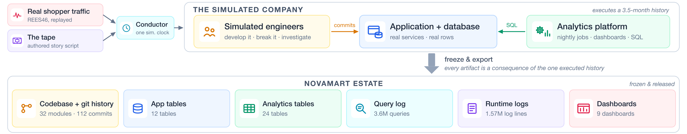

# NovaMart: A Causally Consistent Simulated Enterprise for Measuring Tribal Knowledge Extraction

<p align="center">
  <a href="https://novamart-bench.github.io">Website</a> •
  <a href="https://novamart-bench.github.io">Leaderboard</a> •
  <a href="#citation">Paper</a> •
  <a href="submissions/README.md">Submit</a>
</p>

## 👋 Overview



How much of a company's undocumented knowledge can an AI agent excavate from the data estate alone: the code, the git history, the warehouse, the logs, the dashboards?

NovaMart is a simulated e-commerce retailer that is **executed rather than authored**. Real shopper traffic (the public REES46 event stream) is replayed through a live application and database while LLM-powered engineers act out an authored script of incidents, migrations, and half-finished fixes. Everything a company accumulates builds up as a side effect, then the estate is frozen. Agents get read-only access and a single brief: write the company's missing knowledge book. **51 audited gold claims**, each with a recomputable evidence chain, decide how much they found.

| Estate surface | Scale |
|---|---|
| Application repo, full git history | 112 commits |
| Warehouse tables | 32 |
| Warehouse rows | 878,918 |
| Runtime + query log lines | 5,168,645 |
| Redash dashboards | 9 |
| Simulated history | 3.5 months |
| Audited gold claims | 51 |
| Released baseline books | 9 (3 systems × 3 runs) |

Every order and payment traces back to a real browsing session in the replayed REES46 stream. Every claim is re-verifiable against the shipped estate without the generator.

## 📦 What's in this repo

| Path | Contents |
|---|---|
| `claims/` | the 51 gold claims (YAML): claim text, recomputable evidence chain, scoring rubric |
| `harness/` | the scoring harness (pinned LLM judge, majority-of-five protocol) |
| `books/` | the 9 released baseline knowledge books |
| `results/` | released verdicts for every claim-book cell |
| `prompts/` | the frozen brief given to every agent, verbatim |
| `novamart_estate_samples/` | small head samples of every estate surface |
| `submissions/` | leaderboard submission format and template |
| `website/` | source of the benchmark website |
| `docs/` | evaluation protocol and statistical notes |
| `reproduce_figures_tables.ipynb` | reproduces the paper's tables from `results/` |

The **full frozen estate** (repo bundle, warehouse dump, logs, Redash export) is distributed separately as a versioned dataset; see [Setup](#%EF%B8%8F-setup). This repo stays small on purpose.

## 🏗️ The access surface

Agents reach the estate through the same interfaces enterprise data actually lives behind:

- **BigQuery API** over three datasets: `novamart` (application tables), `novamart_analytics` (analytics tables and views), `novamart_logs` (log exports, including the query log)
- **git** over the application repo
- **Redash** for dashboards

## ⚙️ Setup

**Local (recommended)**: `python setup/setup_local.py` stands up everything with docker compose: the [BigQuery emulator](https://github.com/goccy/bigquery-emulator) loaded with all 36 tables (project `novamart-warehouse`, matching the in-world docs), a seeded Redash with the 9 dashboards, the estate Postgres they query, the application repo checked out at the pin, and your access pack. See [`docs/setup_local.md`](docs/setup_local.md).

**GCP**: `python setup/setup_gcp.py --project your-project-id` loads the three datasets into your own BigQuery project (permission preflight first, nothing created on failure; `roles/bigquery.user` suffices). Agents then use the real BigQuery API at your own scale and cost. Submissions disclose which mode produced the runs. See [`docs/setup_gcp.md`](docs/setup_gcp.md).

## 🧪 Evaluation

Each system runs as shipped, zero-shot, **three times** under the same frozen brief (`prompts/`), with read-only access to the full estate; each run produces one knowledge book. Books are scored per claim by a pinned LLM judge against the claim's rubric, majority over five independent passes. Headline metrics: **mean claim recall** over the three runs and **pass³** (claims solved in all three runs), with claim-level bootstrap 95% CIs.

See [`docs/evaluation.md`](docs/evaluation.md) for the full protocol, metric definitions, and the statistical notes: what score differences this benchmark can and cannot resolve.

## Scoring your book

The judge needs a Gemini API key (`GEMINI_API_KEY`). From the repo root:

```bash
pip install -r setup/requirements.txt
mkdir -p novamart/gold && cp -r claims novamart/gold/claims
python -m harness.cli validate-claims-format novamart
python -m harness.cli score-book --gold novamart --book books/cc_r1.md
```

Replace `books/cc_r1.md` with your own book. `harness/README.md` documents options, judge pinning, and the five-pass majority protocol.

## 🏆 Leaderboard and submissions

The leaderboard at https://novamart-bench.github.io is generated from [`leaderboard.json`](leaderboard.json). To submit: run the three-run protocol, then open a PR adding your three books and a metadata file under `submissions/`; **you compute no statistics**. The maintainer re-scores every submission with the pinned judge and computes all listed numbers during verification. See [`submissions/README.md`](submissions/README.md).

## 🔎 Verification and provenance

Every number in this repo is recomputable: books are scored against the released claims, verdicts are released per claim-book cell, and evidence SQL runs against the shipped estate.

Release note: during release preparation, an internal infrastructure identifier in the world repo's `docs/data-access.md` was replaced with the fictional `novamart-warehouse` (only a single word change in the string). This re-hashed the six final commits of the world repo. The claims' `commit_hash` fields and the brief's commit pin were updated to the current hashes; the nine released books are the verbatim outputs of the original runs and cite the original hashes, as does the paper's printed brief. The mapped commits are content-identical except for that one identifier. The same identifier also appeared in the distributed log fixtures' envelope metadata (logName and resource labels) and was replaced there identically, and three job_runs rows carried a generation-machine file path inside a traceback, replaced with the in-world path; log payload content is byte-unchanged (see CHANGELOG.md).

| Original hash (cited in released books and the paper) | Current hash | Commit |
|---|---|---|
| `1179287` | `d398b0d` | docs: data access after the platform migration |
| `57ea43a` | `41e3537` | chore: move dashboards to Redash |
| `43e54a1` | `4bfcbe6` | chore: migrate schedules from crontab to Airflow |
| `2ae79e2` (full: `2ae79e23690f7ef09a2e9231fdfa3a2cdb84be00`) | `5ae1182` (full: `5ae11821806a396aac10115e03863b8c68c1bfcc`) | feat: warehouse backfill job (serving Postgres -> BigQuery) |
| `2239d10` | `99003c3` | docs: warehouse analytics dataset is novamart_analytics |
| `2d57fa9` | `20e066f` | fix: backfill loads analytics tables into novamart_analytics |

See `CHANGELOG.md` for the exact fields updated.

## 📄 Licenses and attribution

Code is Apache-2.0 (`LICENSE`). The estate, claims, books, and results are CC BY 4.0 (`LICENSE-DATA`). Ambient shopper traffic is replayed from the REES46 eCommerce behavior dataset; see [`ATTRIBUTION.md`](ATTRIBUTION.md).

Note: `<warehouse-project>` placeholders in claims and books resolve to the public BigQuery project at release.

## Citation

```bibtex
@article{novamart2026,
  title   = {NovaMart: A Causally Consistent Simulated Enterprise
             for Measuring Tribal Knowledge Extraction},
  author  = {<authors, added at release>},
  journal = {arXiv preprint arXiv:26XX.XXXXX},
  year    = {2026}
}
```

Maintained by [@susnato](https://github.com/susnato). Questions: open an issue.
